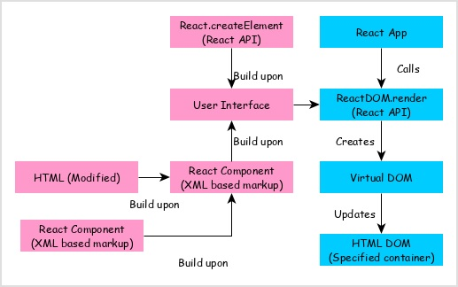

# React.js

 

## 1. Introduction
React is a JavaScript library for building user interfaces, commonly used to create interactive and dynamic web applications. Developed and maintained by Facebook, it allows developers to create reusable UI components and efficiently update the user interface in response to data changes.

 

## 2. Key Features

 

### 2.1 Components
React applications are built using components. Components can be either functional or class-based, encapsulating a piece of the UI.

### 2.2 Props
Properties (props) are used to pass data from a parent component to a child component, allowing for dynamic and customizable components.

### 2.3 State
State represents the internal data of a component, enabling components to manage and respond to changes, updating the UI dynamically.

### 2.4 Lifecycle Methods
React components go through various lifecycle phases, with methods like `componentDidMount`, `componentDidUpdate`, and `componentWillUnmount`.

### 2.5 Event Handling
React components respond to user interactions using event handlers defined in JSX, creating interactive user interfaces.

 

## 3. Other Features

 

### 3.1 Using Conditional Statements
Utilize ternary operators and logical AND/OR for conditional rendering.

### 3.2 Lists and Keys
Render lists by mapping through arrays; keys are crucial for efficient updates.

### 3.3 Form Handling
Implement form handling in React applications.

### 3.4 CSS-in-JS Libraries
Explore libraries that allow styling components directly within JavaScript files.

 

## 4. Hooks in React

### 4.1 Definition
Functions that enable functional components to manage state, perform side effects, and reuse component logic. They address challenges in state management and code reuse.

### 4.2 Types
- `useState`
- `useEffect`
- Custom Hooks
- `useContext`
- `useReducer`
- `useCallback` and `useMemo`
- `useRef`

 

## 5. Uses

 

### 5.1 Single-Page Applications (SPAs)
React is commonly used for building SPAs, providing a smoother and more responsive user experience.

### 5.2 User Interfaces
Effective in building interactive and complex UI for web applications, making large-scale applications more manageable.

### 5.3 Mobile App Development with React Native
Build native mobile applications using React principles for cross-platform compatibility.

### 5.4 Content Management Systems (CMS)
Integrate React into CMS platforms for dynamic and interactive user interfaces in content creation and management.

### 5.5 Collaborative Tools and Real-Time Applications
Used in real-time collaboration apps, messaging apps, collaborative editing tools, and interactive dashboards.

### 5.6 Social Media Applications
Efficiently manages and updates UI components for dynamic and interactive social media applications.

### 5.7 Enterprise Applications
Widely adopted in building enterprise-level applications for CRM systems, project management tools, and internal administrative interfaces.

### 5.8 Educational Platforms
Used in online learning platforms, educational websites, and e-learning applications for dynamic and interactive interfaces.

### 5.9 Open Source Libraries and Tools
Thriving ecosystem with open-source libraries and tools. Developers use React to build reusable UI components shared across various projects.

 

## 6. Key Components and Architecture

### 6.1 Declarative Syntax
Describes how the UI should look and behave, making it easier to understand and debug.

### 6.2 Component-Based Architecture
UI is composed of small, independent, and reusable components, simplifying isolation and troubleshooting.

### 6.3 Virtual DOM
Optimizes rendering performance by updating a virtual representation before efficiently updating the actual DOM.

### 6.4 One-Way Data Binding
Data flows in a single direction, enhancing predictability and ease of maintenance.

### 6.5 JSX (JavaScript XML)
Syntax extension for JavaScript, allowing the writing of UI components more visually.

### 6.6 React Native
Uses React principles to create native mobile apps for iOS and Android with a single codebase.

### 6.7 Community and Ecosystem
Large and active community contributing to a vast ecosystem of third-party libraries, tools, and resources.

