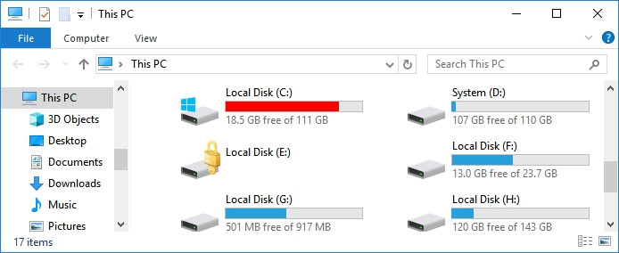
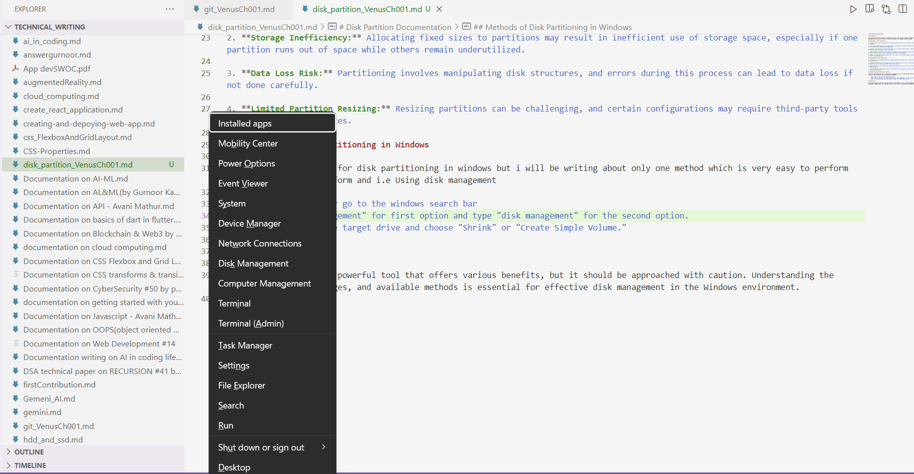
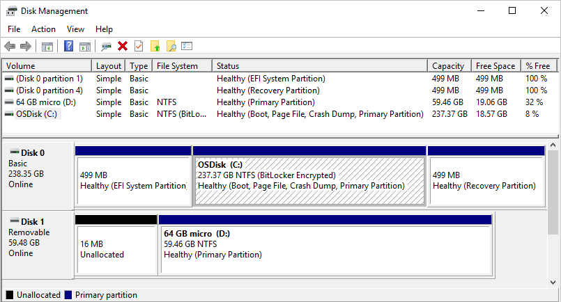
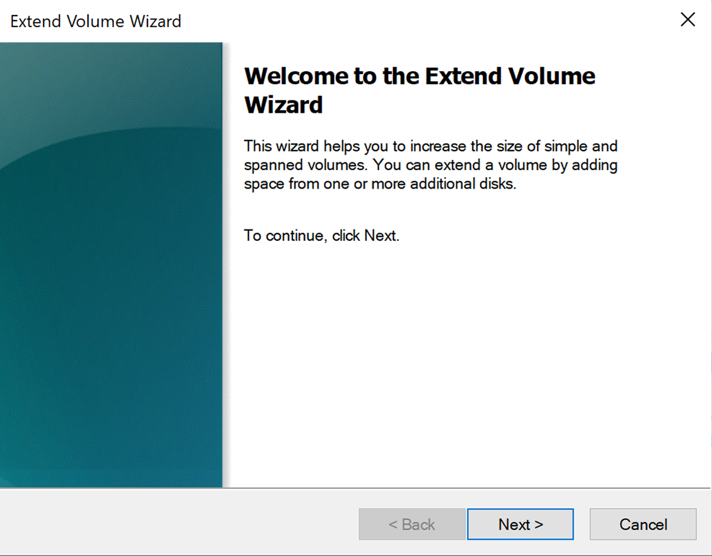

# Disk Partition Documentation

## ⭐ Introduction

Disk partitioning divides a hard drive into multiple logical storage units known as partitions. For example, local disk C: , D: etc.
This documentation provides an overview of disk partitioning in the Windows operating system.

## ⭐ Advantages of Disk Partitioning

1. Partitioning helps to organize data and system files
2. Disk partitioning can improve system performance by segregating operating system files from user data, reducing disk fragmentation.
3. It allows you to isolate sensitive data or specific applications, enhancing security by controlling access to different disk areas.
4. It facilitates efficient backup and recovery processes. You can back up specific partitions without affecting others, making data restoration more targeted.
5. It enables the creation of multi-boot systems, allowing you to install multiple operating systems on a single hard drive.

## ⭐ Disadvantages of Disk Partitioning

1. Partitioning involves manipulating disk structures, and errors during this process can lead to data loss if not done carefully.
2. Resizing partitions can be challenging

## ⭐ Methods of Disk Partitioning in Windows

There are many methods for disk partitioning in Windows, but I will be writing about only one method which is very easy to perform, .e., Using disk management.

   1. Press `Windows icon + X` or go to the Windows search bar

   

   2. select "Disk Management" for first option and type "disk management" for the second option.  

   3. Right-click on the target drive 
   
   

   4. choose "Shrink" 
   5. In the dialog box, edit the amount of space you want your new drive to occupy after shrink
   6. click on "shrink" option
   7. Now, unallocated space will be created
   8. right click on the unallocated space
   9. now click on "Create Simple Volume."
  10. a wizard will open 

  

  11. in the wizard, make changes such as choosing drive letter, volume labels, etc., and click on next again and again 
  12. then, at last, click on "finish."
  13. you will get notification that "new drive is created".

## ⭐ Parting Notes

1. Disk partitioning is a powerful tool that offers various benefits but should be approached cautiously. Understanding the advantages, disadvantages, and available methods is essential for effective disk management in the Windows environment.
   
2. Many users have both SSD and HDD drives then an advice from my side is that keep SSD for Local Disk C and make partition from HDD.
