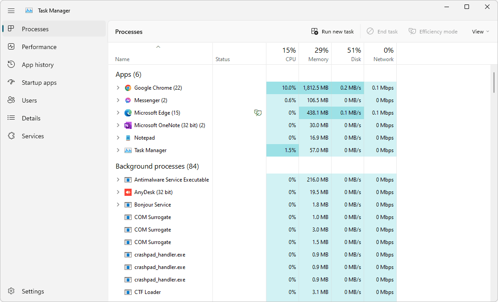
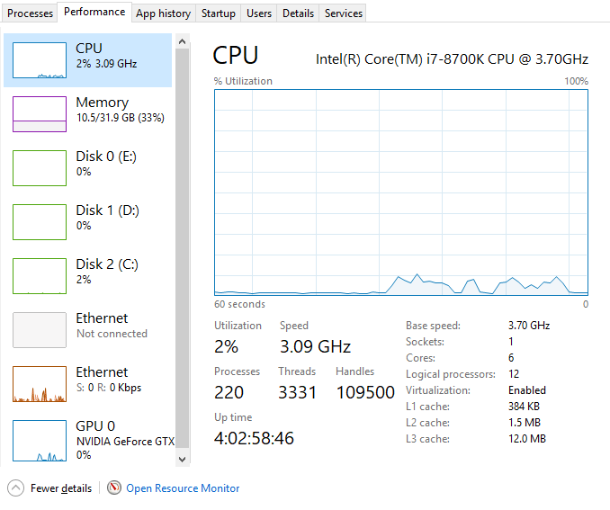
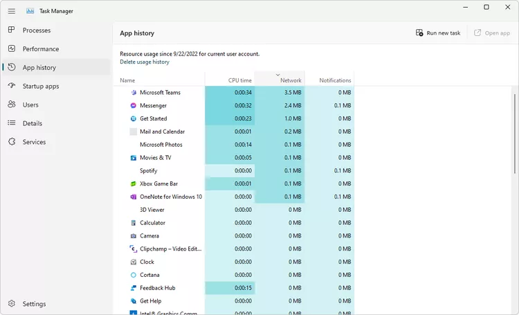
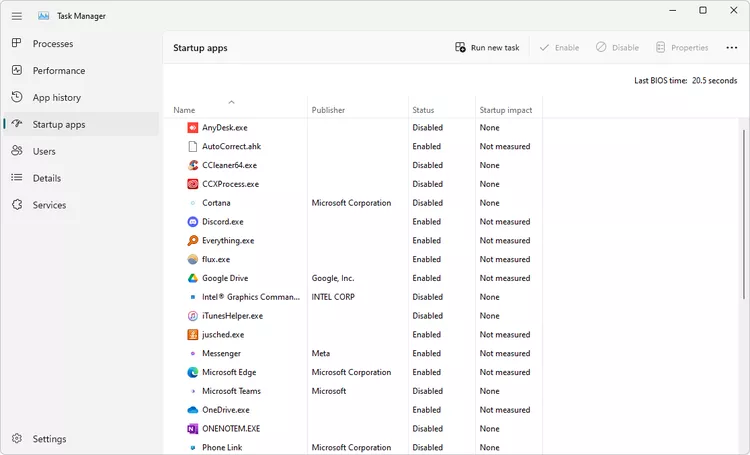
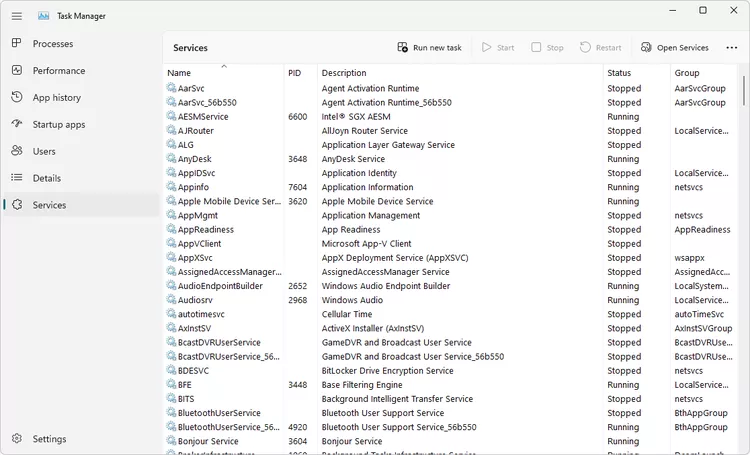

# task manager documentation

## ⭐ how does it look ?

## ⭐ what is task manager
- As the name suggests task manager manages the task but the funny fact is that rarely people uses it for managing the tasks , unless they are exposed to the endless possibilities of task manager.
  
-  Task manager is an interface where we can actually see how the resources are being utilised by different applications , startup programs and background apps on our system.

what we mean by resources is the following:
1. **cpu** - total process utilisation across all cores 
1. **ram (memory)** - physical memory in use by active processes
2. **hard disk (disk)** - total utilisation across all physical drives
3. **internet data (network)** - network utilisation on the current primary network

- Task Manager is included with Windows 11, Windows 10, Windows 8, Windows 7, Windows Vista, and Windows XP

## ⭐features offered by task manager
at the navigation menu in the left , we have the following list:
## 1. process
- Through this tab , one can run new task as well as end the task.
- now you might argue that we can open and close the application manually also i.e. without opening task manager. So my answer is yes , one can do that manually too.
- but my question to you is how you will close the background apps or any other application that is running behind the scenes . 

for example : 
in windows we have the news feature , where we can see the latest news.these news gets updated in the background continously , even though a person have not opened the news at all. so such prcoesses can be deleted from the task manager.

## 2. performance
  
it contains dynamic graphical and static information  about :
- cpu
- disk
- memory
- gpu
- network

## 3. app history  

as the name suggests we get a list of our used applications with the following information also:
- cpu time
- network
- notification

## 4. start up apps

it gives the list of apps that automatically starts as the system is turned on.One can enable and disable these start up apps and know there impact also 

## 5. users,details and services 

this gives information about the  the currently logged on Users and Services of the computer. These can be controlled by an Administrator.

## ⭐you should know this :)
Task Manager is a common target of computer viruses and other forms of malware; typically malware will close the Task Manager as soon as it is started, so as to hide itself from users. Some malware  disables task manager as an administrator.
